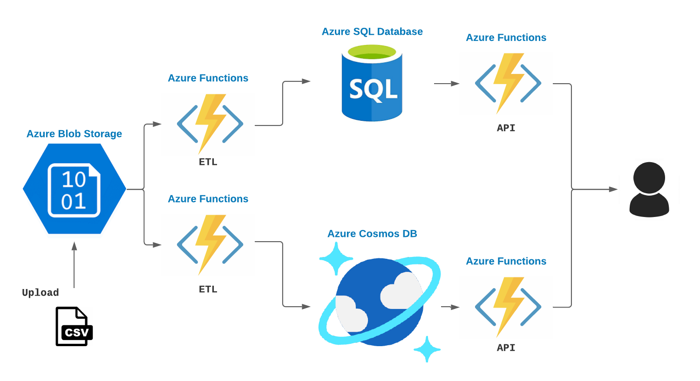

# Felyx Data Engineer assessment

This repository contains a solution for the Data Engineer assessment assignment of Felyx.

The goal was to set up a SQL and a NoSQL database in which reservation business data can be stored. They also have to be filled with data through one or more ETL pipelines and the main content of the 2 databases (the reservation data) has to be queryable through APIs.

# The solution

In this solution I focused on using Microsoft Azure and the associated tech stack. The specific technologies that I used to complete the assignment are:

- Azure SQL Database
- Azure Cosmos DB
- Azure Functions (serverless computing)
- Azure Blob Storage

Azure SQL Database is a Platform-as-a-service offering that I (obviously) used to set up a SQL database. It's essentially a managed version of Microsoft's SQL Server. My choice was mostly based on convenience and familiarity, since I'm currently spending significant time working with Azure SQL Database, and it is probably the most fleshed out SQL offering on Azure.

Azure Cosmos DB is a Platform-as-a-service offering that I used to set up a NoSQL database. It's the main NoSQL offering that Azure has, with most other NoSQL options being provided through third party partners, besides Redis (which, being an in-memory data store, isn't ideal for persistent storage). The database offers 5 different APIs - SQL, MongoDB, Cassandra, Gremlin and Table. For this assignment, I just stuck with the SQL API since it is the most well supported of them all.

Azure Functions is a Platform-as-a-service offering that lets you run Python (and other languages) code in a serverless fashion. This means you don't have to worry about any of the underlying architecture and makes it very easy to scale up or down depending on actual demand. I used this service to build the 2 REST APIs which let you query reservation information from each of the 2 databases. I also used Azure Functions to set up 2 simple Python-based ETL pipelines that are triggered when a new CSV file is stored in a specific part of the cloud storage. This gives a total of 4 Azure Functions.

Azure Blob Storage is the main general storage solution that Azure offers. I used this service to set up a container into which CSV files ("blobs") can be uploaded. Whenever a CSV file is uploaded the 2 ETL pipeline functions (one for each of the 2 databases) load the data, transform it if needed, and store it in the databases.

For the NoSQL database, I opted to denormalize the data before storing it in the database. Due to their nature, NoSQL databases tend to have poor or no support for joins, and Cosmos DB is no exception. By denormalizing the data before storing it, I'm avoiding having to write custom joining logic inside my API code.

## Repository contents

In this repository are 2 folders:

- One contains the Python-based Azure Functions source code that runs the 2 ETL pipelines and the 2 database querying APIs
- One contains several ARM (Azure Resource Manager) templates that are used to set up the resources inside Azure, such as the databases and the storage account. I added these for completeness - you may not have much of an use for them if you don't have access to Azure.

## API usage

The APIs are online at https://felyx-data-apis.azurewebsites.net/
Cosmos DB API: https://felyx-data-apis.azurewebsites.net/api/cosmos/reservations
Azure SQL API: https://felyx-data-apis.azurewebsites.net/api/azuresql/reservations

For both APIs, the query parameters *format* and *addLocation* are supported.
*format* - supports *csv* and *json*. Defaults to *json*. Other input values return an error
*addLocation* - supports *True* and *False*. Defaults to *False*

An example API call:
https://felyx-data-apis.azurewebsites.net/api/cosmos/reservations?format=csv&addLocation=True